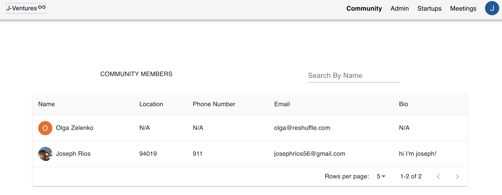

<p  align="center">
  
</p>

Community CMS site made with Reshuffle. Created with material UI.

The following env vars need to exist on deploy

```
ADMIN_EMAIL= // email address domain allowed for admin to get admin prilveges upon signing in.
MONGO_SETUP= // Mongo login setup using Mongo Altas;

```

### Usage

Users can login to as a community member to be to be vetted by an admin to see current/previous/future meetings any current meeting the user will be allowed to vote on with two votes. One vote is for a personally where you are going to invest in and one group vote where the majojity is chosen and the admin can view these votes where they can decide where the community as a whole will invest.

Startups will have their own login flow where they will login with either google/linkedin or make an account and fill out a short questionaire about their company.

As admin the following routes will be available to access `/admin /startups` etc. and all create routes for meetings.

Admins will also have access to see every user type that signs up including startups and users that apply for a community member role.

Admins can also choose which startups will be involved with each meeting where other community members will vote on.

### Backend API calls

Backend is created with Node.js and Express using MongoDB with mongoose for the database.

Authentication is built using Auth0 with social media logins Google and Linkedin.

A proxy is used on port `3001` to connect the backend to the front-end. so all api calls on the front-end will be called like `/api/pathname`

To start the backend server, first `npm install` all dependencies and use `npm run server` to start the server with nodemon or `npm i start` to start the server normally.

### Frontend React APP

Front end is created with CREATE REACT APP.

To start the react app first `cd ./client` then run `npm install` to install all dependencies, after all dependencies are installed run `npm start` to start to react app on localhost:3000.
